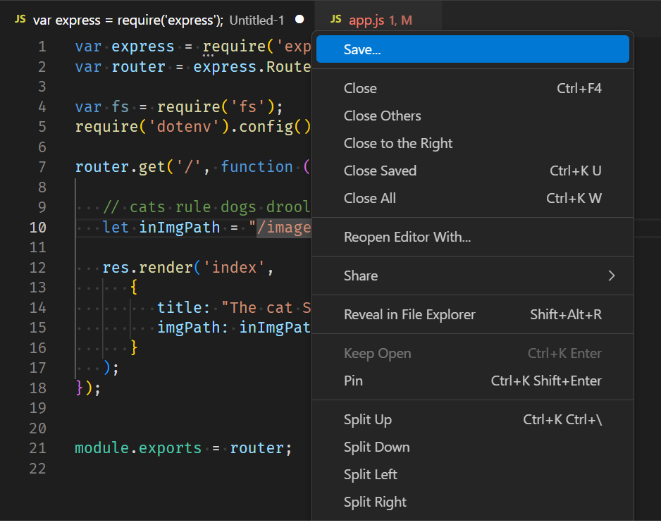

# Editor Tab Save Context Menu

> Note: This extension only works in Visual Studio Code or Visual Studio Code - Insiders.

## Features

This extension adds a new context menus to an Editor tab to Save the file. It is most useful when you have
AutoSave turned on and new Untitled files are added to the workspace.

* **Save...**: Invokes the Save dialog. 

## Using

Right click on an Editor tab, choose **Save...**.




## Packaging

The `repository` field in `package.json` points to `vscode.dev`. Override this to ensure links to artifacts are correct when packaging.

``` bash
 vsce package --baseContentUrl https://github.com/chrisdias/vscode-savecontextmenu/blob/HEAD --baseImagesUrl https://github.com/chrisdias/vscode-savecontextmenu/raw/HEAD
```

## License

[MIT](LICENSE.md)